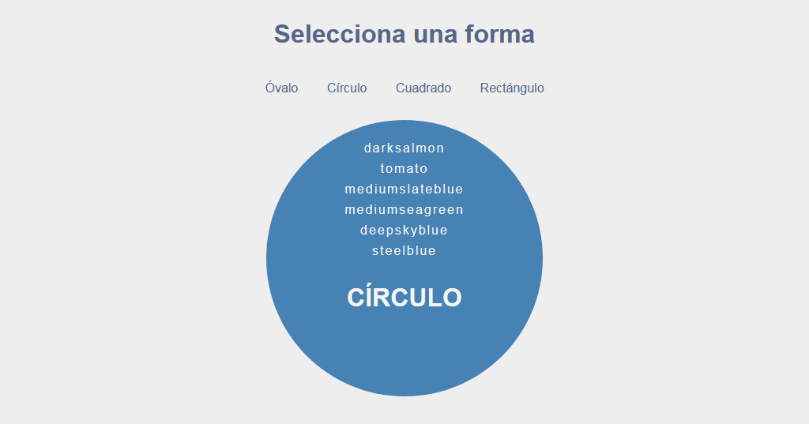

# Manipulando el DOM

`javascript` `CSS` `HTML5`

* Seleccionar elementos
* Crear elementos
* Crear fragmentos en el DOM
* Agregar eventos
* posicionar elementos creados 
* Agregar clases dinamicas como atributo del elemento
* Cambiar estilos dinamicamente a los elementos
* Leer array

